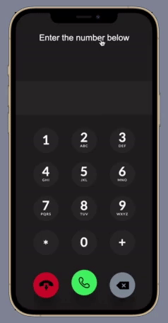

# Chat App with VOIP Calling and SMS using Twilio API (Flutter and Express JS Integration)
Using Twilio's API, a flutter based chat application that can connect with a custom Node JS hosted web service that lets users do VOIP Calls from the app to anywhere around the world.
## Features :
- ##### VOIP Calling to any number across the world
- ##### Sms to phone number directly from the app
- ##### Custom Node JS based web app thats integrated with flutter 
- ##### Chat application with social media features such as posting pictures and stories, DMing and much more
- ##### Access Token for Twilio generated using a custom PHP module hosted in my own server
- ##### Firebase authentication and firestore used to store and manage the data used in the chat app.

# API Reference

## Access Token generation (Using custom hosted Node JS Function)

```http
  GET /token/
```

| Parameter | Type     | Description                |
| :-------- | :------- | :------------------------- |
| `ACCOUNT_SID` | `float` | **Required**. twilio Account Sid |
| `API_KEY` | `float` | **Required**. twilio ApiKey |
| `API_SECRET` | `float` | **Required**. twilio ApiSecret |
| `OUTGOING_SID` | `float` | **Required**. Outgoing Application Sid from TwiML |

#### Output : 

```javascript
{
	"accessToken": "sjadefehfjncjmdxskjedh34354..."
}

```

## Sending a Message (Custom PHP hosted API) 

```http
  POST /sendmessage.php?sid=?&token=?&number=?&body=?
```

| Parameter | Type     | Description                       |
| :-------- | :------- | :-------------------------------- |
| `sid`      | `string` | **Required**. Encoded Twilio Server ID |
| `token`      | `string` | **Required**. Twilio Token |
| `number`      | `string` | **Required**. Number to send the sms |
| `body`      | `string` | **Required**. Message to be sent |


## Configuration :

- ### Buying a phone number from Twilio Console:
  - Log in to your Twilio Console

  - Navigate to Phone Numbers

  - On the 'Buy a Number' screen, select 'Voice' under capabilities, then click 'Search'.
- ### Create an API Key in the Twilio Console.
  - Navigate to Settings > API Keys. On the API Keys screen, click on the 'Create API Key' button in the top right corner.
  - The SID will be the TWILIO_API_KEY for the API/env file. The Secret will be the TWILIO_API_SECRET in your API/.env file. 
- ### Create a TwiML Application in the Twilio Console. 
  - After the TwiML Application is created, click on your TwiML App to find the TwiML App SID.
- ### Set up Twilio Functions and write the code required to generate Access Token with Voice Grant.
  - In the Twilio console, we go to the functions section and set up the env with the required parameters. Then we write the appropriate code required to generate the Access Token.

```javascript
exports.handler = function(context, event, callback) {
  const twilioAccountSid = context.ACCOUNT_SID;
  const twilioApiKey = context.API_KEY;
  const twilioApiSecret = context.API_SECRET;
  const identity = event.identity;
  const AccessToken = Twilio.jwt.AccessToken;

  const token = new AccessToken(
    twilioAccountSid,
    twilioApiKey,
    twilioApiSecret,
    {identity: identity}
  );
  const VoiceGrant = AccessToken.VoiceGrant;

const voiceGrant = new VoiceGrant({
  outgoingApplicationSid: context.OUTGOING_SID,
  incomingAllow: true // allows your client-side device to receive calls as well as make them
});

token.addGrant(voiceGrant);
console.log(token.toJwt());
return callback(null, response);

} 
```
- ### Make a Express Js Web App to make VOIP Calls using Twilio API
  - Make a Node/Express JS app with a custom dialer (using css and html) that can connect with the twilio backend.
- ### Configure Firebase for the chat functionality with firestore to store the data/blobs
## Demo


